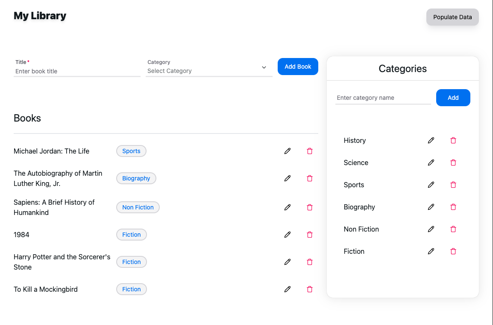

# Apollo Book Library

This sample demonstrates a basic book library application using Apollo Client and Turborepo.




## Table of Contents

- [Apollo Book Library](#apollo-book-library)
  - [Table of Contents](#table-of-contents)
  - [Getting Started](#getting-started)
  - [What's Inside?](#whats-inside)
    - [Utilities](#utilities)
  - [Build](#build)

## Getting Started

To use this example, follow these steps:

1. Clone the repository
2. Install the dependencies with `bun install`
3. Start the development server with `bun dev`

## What's Inside?

This Turborepo includes the following packages/apps:

- `client`: The UI for the library app lives here.
- `server`: The Apollo server lives here.
- `eslint-config-custom`: Contains `eslint` configurations (includes `eslint-config-next` and `eslint-config-prettier`).
- `tsconfig`: Contains `tsconfig.json`s used throughout the monorepo.


### Utilities

This Turborepo has some additional tools already setup for you:

- [TypeScript](https://www.typescriptlang.org/) for static type checking.
- [ESLint](https://eslint.org/) for code linting.
- [Prettier](https://prettier.io) for code formatting.


## Build

To build all apps and packages, run the following command:

```
bun build
```